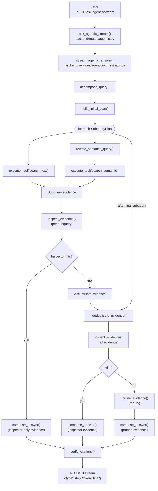

# Agentic RAG Workflow

This document matches the current backend implementation so every box maps directly to code that exists under `backend/routes/agentic.py` and `backend/services/agentic/`.

## Flow Diagram

## Step-by-step Notes

- **Request intake (`backend/routes/agentic.py`)** – `ask_agentic_stream()` accepts `POST /ask/agentic/stream`, trims the query, ensures processed documents exist, waits for the GPU-phase gate, and instantiates `AsyncOpenAI` plus the local `EmbeddingClient`. It then yields the `StreamingResponse` produced by `stream_agentic_answer()`. Every transport frame is NDJSON with `type: "step"`, `"token"`, or `"final"`.
- **Decomposition & deterministic planning** – `stream_agentic_answer()` immediately calls `decompose_query()` (LLM-driven) and records the response as `AgenticStep` zero. When decomposition fails, it falls back to a single `{ "subqueries": [{"query": query}] }` structure. `build_initial_plan()` (pure Python) converts the decomposition into `SubqueryPlan` objects, caps the count to `max_subqueries`, and guarantees each plan has at least one `initial_queries` entry so downstream search has a deterministic input.
- **Retrieval per `SubqueryPlan`** – Every plan deterministically executes the same pair of tools for each subquery (keyword search followed by semantic search), so there is no per-subquery strategy knob:
  - `execute_tool("search_text")` (top_k=5) executes first and appends results directly to the evidence buffer.
  - `rewrite_semantic_query()` rewrites the subquery and immediately invokes `execute_tool("search_semantic")` with `top_k=10`. The rewrite emits its own `AgenticStep` before the semantic tool runs, and the semantic hits are filtered by `MIN_CONTEXT_SIMILARITY` before expansion so only ≥0.6 scores reach the evidence buffers.
  Each tool call emits a progress step that includes the request args, counts, and a preview of the top hits. Tools are only ever invoked through the dispatcher in `backend/services/agentic/tools.py`.
- **Context expansion & evidence hygiene** – Both search tools share the same expansion helpers:
  - Short documents (`token_count ≤ 12k` or ≤20 chunks) are surfaced as one `chunk_id ::full_doc` evidence item with the entire text.
  - Long-document hits get re-expanded into ±10-chunk windows (capped at 20 chunks or ~15k characters) so the inspector/composer can see neighboring paragraphs.
  `_deduplicate_evidence()` removes repeated `chunk_id`s after each subquery and again right before pruning. Evidence that lacks a `chunk_id` is still kept (e.g., inspector synthetic snippets).
- **Subquery inspector short-circuit** – After each subquery’s retrieval pass, the orchestrator prioritizes full-document matches first (`_prioritize_full_doc_evidence`) and calls `inspect_evidence()` with `max_items=AGENTIC_INSPECTOR_MAX_ITEMS`. Inspector callbacks are streamed through `AgenticStep` entries, so the UI can show which docs were scanned. If the inspector returns hits for that subquery, they are converted to synthetic evidence via `_inspector_hits_to_evidence()`, assigned stable `chunk_id`s, and the flow jumps straight to `compose_answer()` with those hits (skipping the remaining subqueries).
- **Pruning fallback** – When no subquery produced hits, the orchestrator trims the accumulated evidence to the top 15 entries via `_prune_evidence()` and composes directly (even if the evidence list is empty). There is no global inspector pass in this path.
- **Answer composition and streaming** – All compose calls go through `compose_answer()` with `stream=True`. Tokens are yielded immediately to the client as `{ "type": "token", "content": ... }`. The orchestration layer records the full prompt/messages for auditing.
- **Citation verification & final frame** – Once streaming completes, `verify_citations()` ensures every bracketed reference matches either a `citation_id` or `doc_hash` present in the supplied evidence. `_build_sources()` builds the source list that is attached to the final NDJSON object together with `steps`, `total_tool_calls`, `finish_reason`, and `needs_clarification=False`. Clarification prompts are not emitted in the current streaming path even though `build_clarification_response()` exists in `modes.py`.

## Components and Responsibilities

- **FastAPI route** – `backend/routes/agentic.py` owns transport validation, GPU readiness checks, and instantiating shared dependencies (`document_store`, `embedding_cache`, `AsyncOpenAI`, `EmbeddingClient`).
- **Orchestrator** – `backend/services/agentic/orchestrator.py` coordinates `AgenticStep` logging, manages evidence buffers, runs the per-subquery inspector, prunes evidence, and streams the final compose pass. It is the only place that touches `stream_agentic_answer()`.
- **LLM modes & prompts** – `backend/services/agentic/modes.py` pairs each helper with a prompt from `prompts.py`: `decompose_query()`, `rewrite_semantic_query()`, `inspect_evidence()`, and `compose_answer()` are the only modes exercised in this flow.
- **Tool layer** – `backend/services/agentic/tools.py` implements `search_text`, `search_semantic`, and `get_document_metadata` plus the shared context-expansion helpers. Only the two search tools are called automatically; metadata lookup remains available for future extensions.
- **Evidence & citation utilities** – `_deduplicate_evidence()`, `_prune_evidence()`, `_assign_citation_ids()`, `_build_sources()`, and `_inspector_hits_to_evidence()` keep the evidence list small enough for the prompts while still sending rich previews back to the client.

Together these components follow a single deterministic loop: decompose → plan → retrieve via keyword/semantic tools → inspect → optionally prune → compose → verify → stream progress. There is no additional clarification stage in the current shipping flow, so any future change that adds one should also update this document and the diagram.
