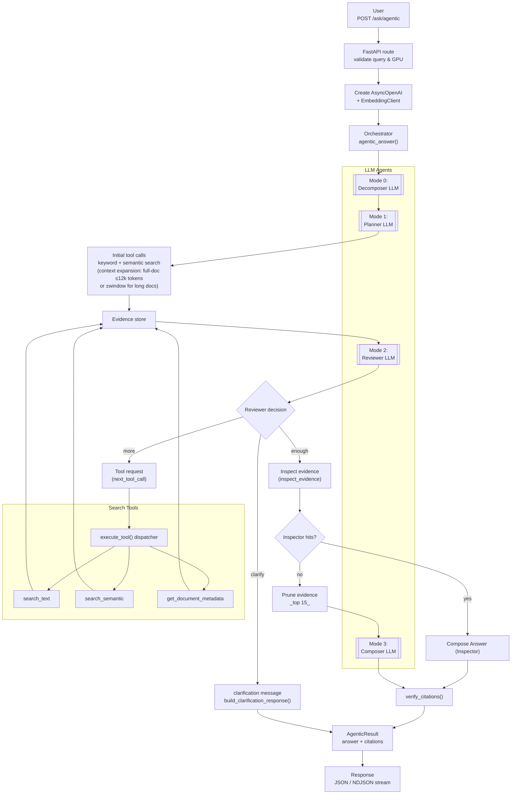

# Agentic RAG Workflow

This document explains how the current backend implements the agentic retrieval flow. It ties together the FastAPI routes, the orchestrator, the LLM modes, and the search tools so you can see the full loop end to end.

## Flow Diagram

## Step-by-step Notes

- **Request intake** – `/ask/agentic` and `/ask/agentic/stream` validate the query, confirm that processed documents exist, ensure a GPU-hosted LLM is available, then instantiate `AsyncOpenAI` and `EmbeddingClient` before handing control to `agentic_answer()` or `stream_agentic_answer()` (`backend/routes/agentic.py`).
- **Query decomposition** – The orchestrator immediately calls `decompose_query()` to capture the user intent, enumerate subqueries, and optionally record output preferences (Mode 0). No routing or search details are produced at this stage; if parsing fails the orchestrator falls back to a single-subquery structure (`backend/services/agentic/orchestrator.py` and `modes.py`).
- **Search planning** – `plan_search()` (Mode 1) receives the original query plus the decomposed subqueries and, for each one, chooses the document buckets, retrieval strategy (keyword / semantic / hybrid), and seed queries. The orchestrator augments these queries with additional hints (e.g., entity attributes) before executing them. Defaults are applied when the LLM cannot produce JSON.
- **Initial retrieval** – For up to two buckets and two initial queries, the orchestrator calls `execute_tool()` with `search_text` and/or `search_semantic` depending on the strategy, collecting snippets as evidence. `search_text` now returns entire short documents (≤12k tokens) as single evidence blobs and, for longer documents, falls back to semantic chunk selection when keyword hits are weak. If a search mode returns zero results, the complementary mode is automatically tried before moving on. Evidence is deduplicated by `chunk_id` to keep the context lean.
- **Context expansion** – `backend/services/agentic/tools.py` now promotes short documents (≤12k tokens, or ≤20 chunks when token counts are missing) into single “full_doc” evidence blobs and expands long-document hits by stitching a ±10-chunk window (capped at 20 chunks). This ensures the model sees nearby paragraphs even when the exact fact is not inside the initial hit.
- **Evidence review loop** – `review_evidence()` (Mode 2) inspects the current plan and snippets and returns a status:
  - `enough` – break out of the loop and move toward answering.
  - `more` – the response includes a `next_tool_call`; the orchestrator executes it (can be `search_text`, `search_semantic`, or `get_document_metadata`) and re-enters the review step until the tool budget is exhausted.
  - `clarify` – the loop halts and the user receives a clarification prompt built by `build_clarification_response()`.
  The streaming endpoint caps this review loop at two iterations even if the tool budget remains to keep UI latency predictable.
- **Evidence inspection** – Before pruning or composing, the orchestrator calls a dedicated inspector LLM mode that walks the first `max_items` evidence entries (whatever order they currently have—typically highest score after dedup) and attempts to extract key facts. The inspector can gather multiple hits, and when it does, those structured snippets are passed to the composer so the final answer is generated from distilled data rather than raw documents; otherwise the flow falls back to pruning + standard composition.
- **Evidence pruning** – Once gathering stops, evidence is sorted by score and trimmed to the top 15 items to protect the token budget for the final prompt.
- **Answer composition** – `compose_answer()` (Mode 3) is run in streaming or buffered mode depending on the endpoint. It receives only the curated evidence and must cite doc hashes directly. The streaming variant yields incremental tokens plus metadata about the prompts that were used.
- **Citation verification** – `verify_citations()` post-processes the answer, replacing any citation that does not point to the known evidence with `[citation needed]` to prevent hallucinated references.
- **Response packaging** – The orchestrator returns an `AgenticResult` containing the final answer, steps, tool usage counts, and evidence summaries. The synchronous route wraps this in `AgenticResponse`, while the streaming route emits NDJSON frames (`step`, `token`, `final`) so clients can visualize tool activity in real time.

## Components and Responsibilities

- **LLM modes & prompts** – `backend/services/agentic/modes.py` and `prompts.py` hold the mode-specific system messages and user templates that constrain decomposer, planner, reviewer, and composer behavior. JSON helpers enforce that each mode returns machine-readable control data.
- **Inspector mode** – The new inspector in `modes.py` uses `INSPECTOR_SYSTEM_PROMPT` / `INSPECTOR_USER_TEMPLATE` to comb through top evidence items, extract structured answers, and short-circuit the flow when a single snippet suffices.
- **Tool layer** – `backend/services/agentic/tools.py` implements keyword search, semantic search, and document metadata lookups, plus the expansion helpers that emit whole-document or chunk-window evidence entries. The orchestrator only ever calls these tools via `execute_tool()` to keep logging and result normalization consistent.
- **Evidence hygiene** – Utility helpers (`_deduplicate_evidence`, `_prune_evidence`, `_build_sources`) guard against bloated context windows and make sure the frontend receives compact previews alongside the answer.

Together, these pieces form a repeatable loop: decompose → plan → search/review (with tool calls) → compose → verify, with graceful fallbacks whenever errors or clarification requests arise.
